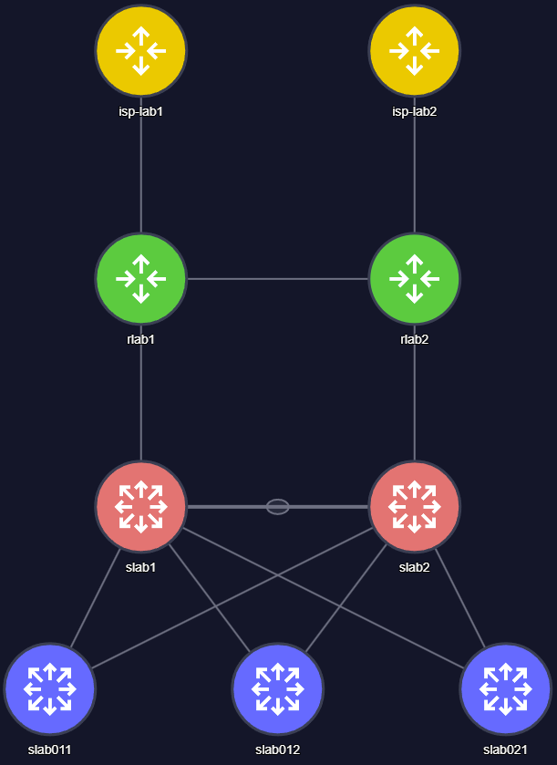

# Network Topology Visualization App

This is an intelligent Network Topology Visualization application that automatically generates and renders professional network diagrams from multi-vendor device configurations or D2 (declarative diagram) files. The application features role-based device detection, multi-vendor config parsing, and a React frontend with FastAPI backend.



## Architecture

**Frontend Framework**: React 18 (loaded via CDN)
- **vis.js Network**: For stable, grid-based network topology visualization  
- **Tailwind CSS**: For styling (loaded via CDN)
- **Babel Standalone**: For JSX transformation in browser
- **Global Functions Pattern**: Pseudo-modular architecture using `window.ComponentName` exports

**Backend**: FastAPI Python server
- Serves static frontend files (HTML, CSS, JS)
- Provides REST API for D2 topology data discovery and serving
- Automatic site discovery by scanning `sites/` directory recursively
- Supports both single `.d2` files and multi-file sites with `main.d2`

**Data Sources**: D2 files in the `sites/` directory
- Automatically discovers all `.d2` files and `main.d2` + device combinations
- Supports hierarchical organization and multi-file site structures
- Extracts metadata from D2 file comments and filenames
- Example: `sites/gns3-lab/main.d2` + `sites/gns3-lab/devices/*.d2`

**Additional Assets**:
- `assets/icons/` - Professional SVG icons for device types (router, switch, firewall, wifi, cloud)

**Application Structure**:
- `index.html` - Main entry point with modular architecture using global functions
- `src/components/` - Reusable UI components (exported as global functions)
- `src/hooks/` - Custom React hooks for data and state management
- `src/utils/` - Utility functions and parsers
- `api/` - FastAPI backend for serving D2 files and static assets
- `sites/` - D2 topology files (automatically discovered)

## Development Commands

**First-time setup:**
```bash
npm run setup    # Installs Python dependencies in virtual environment
```

**Start the application:**
```bash
npm run start    # Starts FastAPI backend + serves frontend on port 8000
npm run api      # Same as npm run start
```

**Multi-vendor config parser (Cisco & Aruba to D2):**
```bash
npm run config-parser    # Parse GNS3 lab configs with automatic role detection
# Or with custom paths:
./scripts/config-parser.sh "path/to/configs" "output/dir" "Site Name" "Location"
```

**Access the application:**
- Frontend: http://localhost:8000
- API docs: http://localhost:8000/docs

**Architecture Note**: The application uses a pseudo-modular approach where components are loaded as global functions via Babel script tags. This allows separation of concerns without requiring a build system, but **dependency order matters** - utilities must load before hooks, hooks before components.

## Role-Based Device Detection

The application features an intelligent role-based device detection system that automatically categorizes network devices based on hostname patterns:

### Device Roles & Color Coding
- 🔴 **Core Switches**: `core_switch` - Devices starting with 's' and ending with 1 digit (slab1, slab2)
- 🔵 **Access Switches**: `access_switch` - Devices starting with 's' and ending with 3 digits (slab011, slab012, slab021)  
- 🟢 **Routers**: `router` - Devices starting with 'r' (rlab1, rlab2)
- 🟠 **Firewalls**: `firewall` - Devices starting with 'f' (fw01, firewall1)
- 🟣 **Wireless Controllers**: `wireless_controller` - Devices starting with 'w' (wlc01, wireless1)
- 🟡 **ISP Provider Edge**: `isp_pe` - Devices starting with 'isp' (isp-att, isp-verizon)

### Role-Based Features
- **Visual Organization**: Device list grouped and color-coded by role
- **Network Visualization**: Role-based background colors for instant device identification
- **Hierarchical Layout**: Roles enable future automatic hierarchical network layouts
- **Automatic D2 Generation**: Config parser assigns roles during D2 file creation

## Key Components

### Utilities (`src/utils/`)
- **`d2Parser.js`** - Parses D2 syntax into devices, interfaces, and connections with role support
- **`deviceUtils.js`** - Role-based device detection, type detection, icons, colors, and interface utilities
- **`layoutUtils.js`** - Layout controls for vis.js Network (reset, arrange, grid snap)

### Custom Hooks (`src/hooks/`)
- **`useNetworkData.js`** - Fetches and processes D2 topology data from FastAPI backend
- **`useVisNetworkVisualization.js`** - vis.js Network setup with role-based colors, stable positioning and layout controls

### Components (`src/components/`)
- **`SiteTreeNavigation.js`** - Site selection with hierarchical organization
- **`NodeListPanel.js`** - Role-based device grouping and color-coded device overview list
- **`DeviceDetailsPanel.js`** - Layer 2 device information with role display and interfaces
- **`Layer3Panel.js`** - Routing protocols, SVIs, Layer 3 configuration
- **`ConnectionDetailsPanel.js`** - Link details between devices
- **`Modals.js`** - Access points modal and routing table modal

### Core Features
- **Role-Based Device Detection**: Automatic categorization by network function with color coding
- **Multi-Vendor Config Parser**: Cisco IOS/IOS-XE and Aruba OS-CX configuration parsing
- **vis.js Network Visualization**: Stable network topology with role-based colors and auto-stabilization
- **Intelligent Topology Generation**: Subnet-based connection auto-discovery from configurations
- **Multiple Connection Handling**: Smart edge processing with minimal curves for clarity and clickability
- **Grid-Based Layout**: Professional diagram positioning with snap-to-grid functionality
- **Layout Controls**: Reset, hierarchical arrangement, and grid snap features
- **Device Role Support**: Core switches, access switches, routers, firewalls, wireless controllers, ISP PE
- **Interface Management**: Physical ports, SVIs, and LAG interfaces with detailed configuration
- **Routing Information**: OSPF, BGP, static routes, and VRRP/HSRP status with protocol-specific details
- **External Connection Support**: WAN/ISP provider integration with circuit details
- **Professional SVG Icons**: Custom icon set for consistent device representation
- **LAG Support**: Link Aggregation Groups with visual indicators and LACP configuration
- **FastAPI Backend**: Automatic site discovery and REST API for topology data
- **Enhanced D2 Generation**: Role-aware D2 files with multi-vendor device support

## Working with D2 Files

D2 files use a hierarchical syntax with role-based device definitions:
```d2
device_name: {
  label: "Display Name"
  type: "router|switch|firewall|wireless_controller|wan_provider"
  role: "core_switch|access_switch|router|firewall|wireless_controller|isp_pe"
  mgmt_ip: "192.168.1.1"
  model: "Device Model"
  
  interface_name: {
    description: "Link description"
    ip_address: "10.1.1.1/24"
    status: "up|down"
    vlan: "100"
    switchport_mode: "routed|access|trunk"
    bandwidth: "1Gbps"
  }
  
  # LAG interfaces supported
  lag_1: {
    description: "Link Aggregation Group"
    ip_address: "192.168.100.0/31"
    protocol: "LACP"
    port_channel: "true"
    status: "up"
  }
  
  # Routing Configuration (auto-generated by config parser)
  ospf_enabled: "true"
  ospf_process_id: "1"
  ospf_router_id: "10.0.1.1"
  ospf_areas: "0.0.0.0"
  bgp_enabled: "true"
  bgp_as: "65000"
  bgp_neighbors: "192.168.1.1 AS65001"
}

# Connections
device1.interface1 -> device2.interface2
```

**Device Roles & Types Supported**:

**Network Infrastructure Roles**:
- `core_switch` - Core network switches (slab1, slab2) - High-capacity, redundant switches
- `access_switch` - Access layer switches (slab011, slab012, slab021) - End-user connectivity
- `router` - Layer 3 routing devices (rlab1, rlab2) - Inter-network routing
- `firewall` - Security appliances - Network security and access control
- `wireless_controller` - Wireless LAN controllers - Centralized wireless management
- `isp_pe` - ISP Provider Edge routers (isp-att, isp-verizon) - External connectivity

**Legacy Device Types** (for backward compatibility):
- `switch` - Generic Layer 2/3 switching devices
- `access_point` - Wireless access points
- `wan_provider` - External/WAN connection providers (ISP, MPLS, etc.)

**Interface Properties**:
- Physical interfaces (ethernet, gigabit, port patterns)
- Channel groups and port channels
- LAG (Link Aggregation) interfaces - Added support for "lag" keyword detection
- SVI interfaces (vlan10, vlan20, etc.)
- WAN interfaces (WAN1, WAN2, etc.) for external connections
- Configuration includes VLANs, IP addressing, routing protocol settings
- Provider circuit information (bandwidth, circuit ID, SLA class)
- BGP session configuration (eBGP/iBGP, ASN, neighbor details)
- LACP configuration for port channels and LAG groups

## Multi-Vendor Configuration Parser

The application includes an intelligent configuration parser that supports multiple network device vendors:

### Supported Platforms
- **Cisco IOS/IOS-XE**: CSR1000V, ISR routers, Catalyst switches
- **Aruba OS-CX**: CX series switches with OSPF and interface configurations

### Parser Features
- **Automatic OS Detection**: Analyzes configuration syntax to determine device platform
- **Role-Based Device Classification**: Assigns network roles based on hostname patterns
- **Intelligent Connection Discovery**: Analyzes IP subnets to automatically detect device connections
- **Routing Protocol Extraction**: Parses OSPF, BGP configuration with neighbor relationships
- **Interface Configuration**: Extracts physical interfaces, LAGs, SVIs with detailed settings
- **D2 Generation**: Creates role-aware D2 topology files with complete device and connection data

### Usage Examples
```bash
# Parse default GNS3 lab (sites/gns3-lab/configs → sites/gns3-lab/)
npm run config-parser

# Parse custom configuration directory
./scripts/config-parser.sh "/path/to/configs" "/output/dir" "My Network" "Data Center"

# Supported file types: *.conf files (Cisco and Aruba configurations)
# Output: main.d2 + devices/ subdirectory with individual device files
```

### Automatic Features
- **Hostname-Based Role Detection**: Automatically categorizes devices by network function
- **Subnet-Based Topology**: Discovers connections by analyzing interface IP addresses
- **Multi-File D2 Structure**: Generates organized topology with centralized connections
- **Vendor-Agnostic Output**: Unified D2 format regardless of source device vendor

## File Organization

### Frontend Architecture
- **No build system** - Uses `<script type="text/babel">` tags for JSX transformation
- **Global function pattern** - Components exported as `window.ComponentName = ...`
- **Dependency order matters** - Utilities → Hooks → Components → Main App
- **Module loading via index.html** - All script tags must be added to index.html

### Backend Architecture
- **FastAPI** serves static files and provides REST API for D2 topology data
- **Automatic site discovery** - Scans `sites/` directory for `.d2` files recursively
- **Multi-file site support** - Sites can use `main.d2` + individual device files in `devices/` subdirectory

### Site Organization
- **Single files**: `sites/branch.d2`, `sites/big branch.d2`
- **Multi-file sites**: `sites/gns3-lab/main.d2` + `sites/gns3-lab/devices/*.d2`
- **Hierarchical**: `sites/region/country/city.d2` (automatic discovery)
- **Metadata extraction**: From D2 comments and file structure

## Adding New Features

### Device Roles & Types
1. **Add new device role**: Update `detect_device_role()` in `scripts/config-parser.py`
2. **Update role colors**: Modify role color mappings in `deviceUtils.js` `getDeviceColor()`
3. **Update UI display**: Add role names and priorities in `NodeListPanel.js`
4. **Add device type**: Update `getDeviceIcon()` and fallback colors in `deviceUtils.js`
5. **Update D2 parser**: Ensure role detection in `d2Parser.js` if needed

### Multi-Vendor Parser Support
1. **Add new vendor**: Create new parser class in `scripts/config-parser.py`
2. **Update OS detection**: Modify `detect_device_os()` function with vendor patterns
3. **Test configuration parsing**: Ensure interface and routing protocol extraction works
4. **Validate D2 output**: Check generated D2 files have correct role and type assignments

### Interface Properties
1. Extend D2 parser's property extraction in `parseD2ToGraph()`
2. Update interface utility functions in `deviceUtils.js`
3. Add UI rendering in `DeviceDetailsPanel.js` or `ConnectionDetailsPanel.js`
4. Update config parser to extract new properties from device configurations

### New Components
1. Create in `src/components/` with `window.ComponentName = ...` export
2. Add `<script>` tag to `index.html` (order matters)
3. Reference as `<window.ComponentName>` in JSX
4. Consider role-based functionality for enhanced user experience

## Common Tasks

**Adding new D2 files**: 
- Place in `sites/` directory (or subdirectories for organization)
- Files are automatically discovered and loaded
- Add metadata in D2 file comments for better organization

**Modifying visualization**: 
- Update vis.js Network configuration in `useVisNetworkVisualization.js`
- Modify network options, physics settings, or layout algorithms
- Add new layout control functions (reset, hierarchical, grid snap)

**Extending UI panels**: 
- Edit component files in `src/components/`
- Add new sections to existing panels or create new components

**Adding utility functions**:
- Create or extend files in `src/utils/` with global exports (`window.functionName = ...`)
- Add script tag to `index.html` to load utilities before components
- Reference functions as `window.functionName()` in components

## Important Notes

- **Role-based architecture:** Device roles drive color coding, organization, and future hierarchical layouts
- **Multi-vendor support:** Cisco IOS/IOS-XE and Aruba OS-CX configurations automatically parsed and unified
- **Module loading order:** Utilities must load before hooks, hooks before components
- **Global exports:** All modules use `window.functionName = ...` pattern for cross-file access
- **No TypeScript/build system:** Pure JavaScript with Babel transformation in browser
- **vis.js Network:** Provides stable, professional network visualization with role-based colors
- **FastAPI backend required:** Frontend depends on `/api/sites` endpoint for topology data
- **Intelligent topology generation:** Config parser automatically discovers connections via subnet analysis

## Visualization Technology

The application uses **vis.js Network** for professional, stable network topology visualization. This provides:

### Key Features
- **Stable Positioning**: Nodes don't bounce around like D3 force simulations
- **Professional Layout**: Grid-based positioning suitable for network documentation
- **Multiple Connection Support**: Handles multiple links between same devices with minimal curves
- **Interactive Controls**: Reset layout, hierarchical arrangement, and grid snap functionality

### User Interface
- **Click & Drag**: Move devices around the canvas
- **Zoom**: Scroll to zoom in/out
- **Device Selection**: Click devices or connections for detailed information
- **Layout Controls**: Use buttons to reset, arrange hierarchically, or enable grid snap

### Edge Processing
Multiple connections between the same devices are automatically processed to:
- Keep the first connection perfectly straight
- Add minimal curves (0.08-0.2 roundness) to subsequent connections
- Ensure all connections remain individually clickable
- Maintain visual clarity and professional appearance